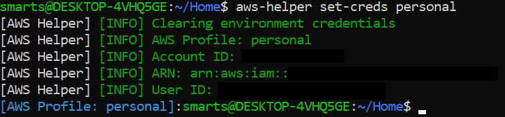
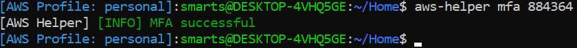
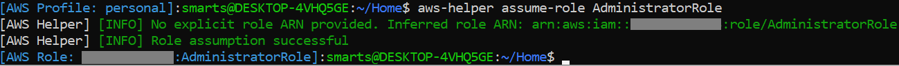
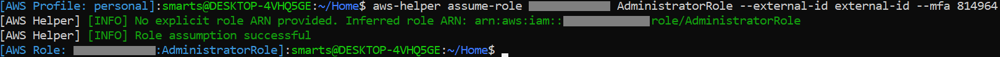

# Bash AWS Helper
A helper script to ease some of the pain involved in mandatory MFA and Cross-Account Roles using the CLI.

## Installation
Copy the aws_helper.sh file into your home directory and add `. ~/aws_helper.sh` to the end of your `~/.bash_profile`.
Ensure this is loaded into your current shell by either relogging or running the command `source ~/aws_helper.sh`.

## Examples
Setting credentials  


MFA Authentication  


Assuming a role  


Assuming a role with MFA & External ID requirements


## Usage
All commands are available via `aws-helper` and support tab completion. Each command supports the `help` subcommand for further information.
See an outline of the commands below.

#### aws-helper set-creds
---
Set AWS_PROFILE environment variable and validate credentials. See [Named Profiles.](https://docs.aws.amazon.com/cli/latest/userguide/cli-configure-profiles.html)

Usage: `aws-helper set-creds [PROFILE]`

Notes: If profile is not provided then stdin is used.


#### aws-helper set-creds validate
---
Validate current AWS environment credentials.

Usage: `aws-helper validate [OPTIONS]`

Options:
```
--silent  Suppress stdout & stderr
```


#### aws-helper mfa
---
Obtain STS token using MFA and set environment variables accordingly.

Usage: `aws-helper mfa [MFA TOKEN] [OPTIONS]`

Options:
```
--duration VALUE  Duration, in seconds, that credentials should remain valid.
                  Valid ranges are 900 to 129600. Default is 43,200 seconds (12 hours).
```

Notes: If token is not provided then stdin is used.


#### aws-helper mfa-validate
---
Validate current AWS STS MFA credentials.

Usage: `aws-helper mfa-validate [OPTIONS]`

Options:
```
--silent  Suppress stdout & stderr
```


#### aws-helper assume-role
---
Assume a role. Provide either a role name and account or the role arn. If no account
is provided then the current account is implicitly assumed.

Usage: `aws-helper assume-role (ROLE-ARN) OR (ROLE-NAME [ROLE-ACCOUNT]) [OPTIONS]`

Options:
```
--external-id ID  External ID to use if required
--mfa TOKEN       For roles that require MFA to be present
--duration VALUE  Duration, in seconds, that credentials should remain valid.
                  Valid ranges are 900 to 129600. Default is 3,600 seconds (1 hour).
```


#### aws-helper clear
---
Clear current environment credentials.

Usage: `aws-helper clear`


#### aws-helper help
---
Display a list of commands along with a brief summary.

Usage: `aws-helper help`

#### aws-helper list-creds
---
Display a list of credential options from the users local configuration

Usage: `aws-helper list-creds`

## Configuration File
If you have a long role name, a combination of account & role name, or any other frequently 
used assume-role command, then you can create aliases to these commands by adding them to the
file `~/.aws-help/config`. These aliases can then be used by running the command
`aws-helper assume-role alias-name`

### Example
---
```
[long-named-role]
AWSPowerUserWithBillingAccessAndMFAValidationProduction

[role-with-account-id]
12345678912 my-production-role

[role-arn]
arn:aws:iam::12345678912:role/role-name

[role-with-switches]
12345678912 my-production-role --duration 900
```